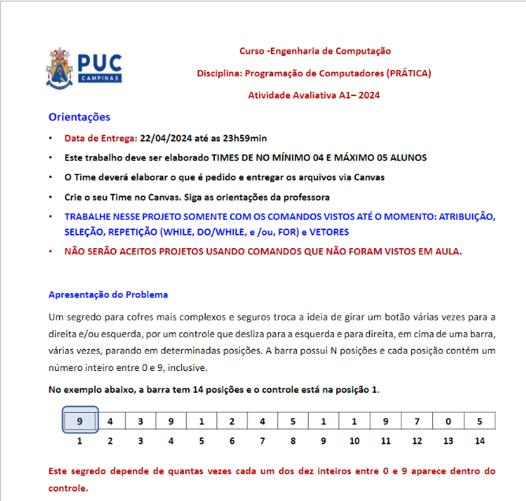

# 🔑 | Atividade Avaliativa (A1) | Programação de Computadores

Bem-vindo(a) ao repositório que contém a solução para o problema proposto na atividade avaliativa "A1" da disciplina de Programação de Computadores (orientadora: Lúcia Filomena de Almeida Guimarães) do curso de Engenharia de Computação da [@PUC-Campinas](httpsL://puc-campinas.com).

Esse documento tem como propósito apresentar uma análise geral do projeto proposto, destacando seus objetivos, funcionalidades e construção com comandos vistos durante as aulas da disciplina até o presente momento, além de reportar os desafios enfrentados pela equipe durante seu desenvolvimento. 
O projeto/problema proposto visava desenvolver um sistema de controle para a abertura de um cofre didático a partir de uma combinação específica (definida incialmente pela própria equipe de desenvolvimento) de uma barra de 25 posições apenas com os dígitos 1, 2, 5, 7 e 8, na qual o usuário digitaria os deslizamentos desejados e o programa determinaria se o cofre seria aberto ou não.

Happy hacking!

<!-- > ⚠️ **É importante ressaltar que este projeto/repositório se encontra em constante atualização.** -->

## 🧠 Desenvolvimento

O projeto, pautado pelas informações e etapas propostas neste [documento](https://puc-campinas.instructure.com/courses/51260/assignments/159955?module_item_id=361238) (https://puc-campinas.instructure.com/courses/51260/assignments/159955?module_item_id=361238), apresenta, de maneira geral, não apenas a funcionalidade de deslizamento dos limites e conferência da combinação para abertura do cofre, mas também uma interface intuitiva para o usuário, o que, por sua vez, facilita e auxilia na compreensão e eventual utilização do programa. Nesse sentido, é possível dizer que o desenvolvimento/criação da interface gráfica do programa não apresentou dificuldades à equipe de desenvolvimento, dada sua estrutura simples, facilitando, assim, a compreensão do código pelos membros e o programa pelo usuário.

Sobre a utilização das funcionalidades e comandos vistos e estudados durantes as aulas da disciplina, para a criação do projeto e solução do problema proposto foram utilizados, principalmente, os comandos “do/while” para controle das tentativas mal-sucedidas (1), “for” para atribuição de valores aos deslizamentos (2) e “if/else” para criação de diferentes condições de execução ao longo do programa (3). Além disso, a barra de números foi tratada como um vetor, o qual apresenta, como mencionado no documento, um tamanho máximo de 25 posições (organizadas de 0 - 24), valor esse atribuído à uma constante (possível de ser alterada no código fonte), assim como seu conteúdo, neste caso, os dígitos 1, 2, 5, 7 e 8 organizados de maneira aleatória pela equipe de desenvolvimento. 
→ (1) Como conteúdo obrigatório do programa, no 3º passo (saída), o sistema deveria permitir que o usuário tentasse, no máximo, 3 vezes até acertar a combinação/senha. Para tanto, foi necessário utilizar o comando condicional “do/while” englobando todo o conteúdo do código para que, caso o usuário encontrasse uma combinação diferente da correta, fosse possível, enquanto o número de tentativas fosse menor que três, repetir o processo até a eventual abertura do cofre. Caso o usuário esgotasse as três tentativas limites durante o processo, o programa se encerra e exibe uma mensagem na tela informando-o. Além disso, se o usuário encontrar a combinação correta definida no código pela equipe de desenvolvimento em qualquer uma das tentativas, o processo se encerra, o cofre é aberto e uma mensagem de sucesso é exibida na tela, mostrando que a abertura foi bem-sucedida.

→ (2) Em relação ao 2º passo (entrada – cálculo), foi solicitado que o sistema/programa fosse, de acordo com o número de deslizamentos informado pelo usuário anteriormente, perguntando a posição que ele desejasse mover o controle (limites) na barra, a partir da posição que ele se encontrasse (a posição inicial, como mencionado no documento, deveria ser a 10º posição). Para tanto, foi possível, a partir do comando “for”, criar loopings para a movimentação dos controles até que o processo se encerrasse, armazenando os conteúdos entre os limites e incrementando o número de vezes que os dígitos aparecerem na barra.

→ (3) Sobre o 1º passo (definições), o documento informava que o usuário deveria ter a possibilidade de parar seus deslizamentos digitando um número negativo, por exemplo. Para isso, no interior do “for” de deslizamentos, foi utilizado uma condição “if” para que, caso o número informado/digitado fosse menor que 0 (negativo), o processo se encerrasse automaticamente – exit(0). Além disso, foi utilizada uma condição “if” na etapa em que o usuário informa o número de deslizamentos a serem realizados, na qual: caso o número de movimentos seja menor ou igual a 0 (negativo), seria exibida uma mensagem na tela com o seguinte conteúdo “não é possível abrir o cofre sem realizar nenhum movimento”; e caso o número de movimentos fosse maior que 4 (máximo estipulado), fosse exibida uma mensagem na tela com o seguinte conteúdo “não é possível realizar mais que 4 movimentos! Insira um número válido...”. Como funcionalidade extra/opcional, o usuário deveria ser capaz de definir a quantidade de deslizamentos a serem realizados (de 1 – mínimo - a 4 - máximo).

→ (4) Ainda sobre o 1º passo (definições), também foi solicitado para que o tamanho da barra/vetor tivesse no máximo 25 posições, e, para isso, foi criada uma constante (declarada no topo do código juntamente com a inclusão/importação das bibliotecas utilizadas) chamada “length”, cujo valor atribuído é igual ao comprimento máximo do vetor, nesse caso, 25, facilitando eventuais alterações. A inicialização dos valores com os dígitos que constituiriam a barra também deveria ser feita de forma que a professora pudesse alterar os valores a serem inseridos no programa fonte, sendo necessário, portanto, criar o vetor, cujo nome é “safe_bar”, e atribuir diretamente seus valores através das “{}”.

→ (5) Além das necessidades de desenvolvimento solicitadas no documento do projeto que deveriam ser respeitadas e atendidas, a equipe implementou um sistema de retorno (novas tentativas) em duas etapas diferentes do código, sendo possível executar esta ação após digitar um número negativo no deslizamento e/ou executá-la ao final da abertura do cofre, isto é, ao encontrar a combinação correta. Para isso, foi necessário utilizar um comando estudado também durante as aulas da disciplina de Programação de Computadores do curso, sendo ele o comando “switch”, o qual necessita, por sua vez, neste caso, de duas variáveis: “return_option” e “closure_option”, responsáveis, respectivamente, pela execução com números negativos e ao final da execução. Ambas apresentam a mesma estrutura de código, sendo esta representada por uma série de mensagens exibidas na tela do usuário para auxiliá-lo no processo, assim como o escaneamento da opção digitada para que seja possível executar a determinada ação desejada.

Em relação às dificuldades encontradas durante o desenvolvimento do projeto/código, é possível dizer que o principal desafio foi encontrar uma forma de ler as posições durante os deslizamentos e os valores entre os novos limites estabelecidos. Uma solução válida encontrada foi a criação de cinco contadores diferentes (C1, C2, C5, C7 e C8), um para cada dígito, e incrementar 1 ao valor anterior ao término do loop “for” do deslizamento. Ao final de todo o processo, os contadores são comparados com os valores estabelecidos para a combinação correta. Se forem semelhantes, o cofre é aberto e uma mensagem de sucesso é exibida a tela do usuário; caso contrário, o usuário ganha uma nova tentativa e é forçado a reiniciar o processo de abertura do cofre (até o limite de 3 tentativas).
A senha/combinação correta para a abertura do cofre, em nosso caso, foi definida com 4 deslizamentos, sendo eles: inicialmente da posição 10 (inicial) para a posição 4, da posição 4 para a posição 19, da posição 19 para a posição 24, e, por fim, da posição 24 novamente para a posição 19. Ao término dos deslizamentos, a combinação final correta encontrada e definida para a abertura do cofre é: 512376, isto é, os números 1, 2, 5, 7 e 8 apareceram, respectivamente, 5, 12, 3, 7 e 6 vezes ao total.

## 🤝 Integrantes

<table>
  <tr>
    <td align="center">
      <a href="https://github.com/galembeck" title="Pedro Galembeck">
         
        
          <b>Pedro Galembeck</b>
        
      </a>
    </td>
    <td align="center">
      <a href="https://github.com/Arduinh0/" title="Rocketseat">
         
        
          <b>Arthur Camilotti</b>
        
      </a>
    </td>
  </tr>
</table>

Made with 💜 by Pedro Galembeck.
